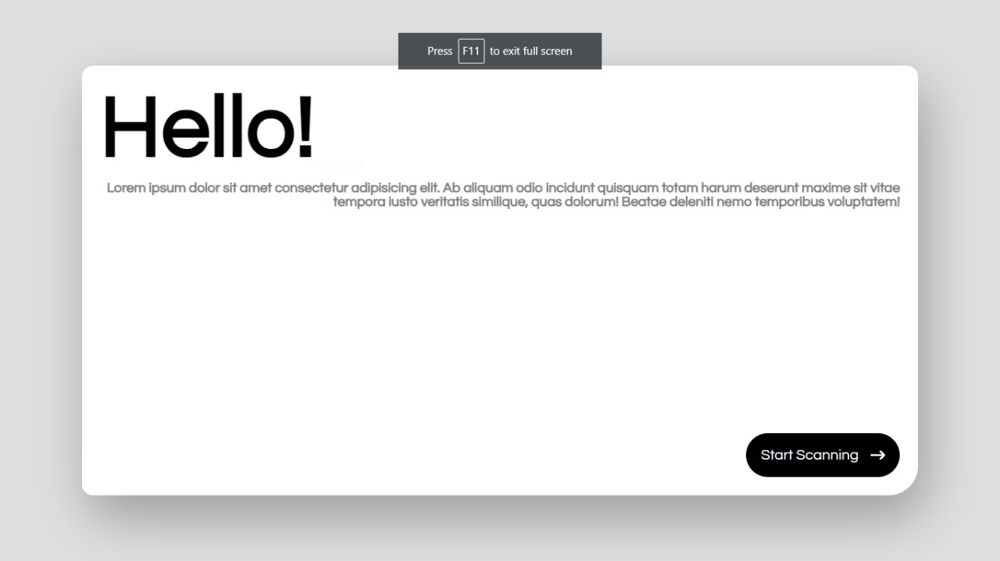
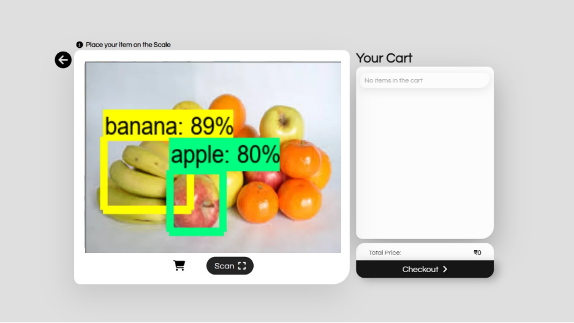
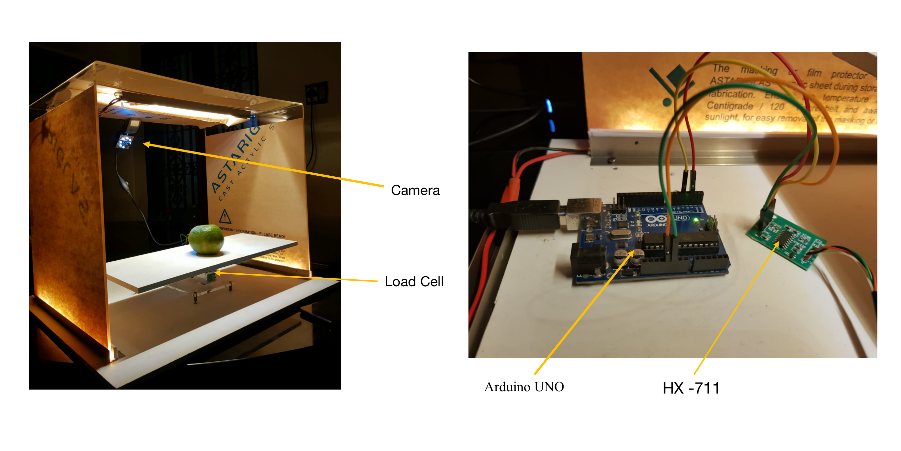

## React Checkout System Interface
## Overview 💻

A modern and responsive checkout system interface developed using React. The interface is designed to provide a seamless and user-friendly experience for users during the checkout process.

## Features 🚀

- Intuitive User Interface: A clean and intuitive user interface designed to guide users through the checkout process effortlessly.
- Product Information: Display of detailed product information, including images, names, quantities, and prices.
- Quantity Adjustment: Ability to dynamically adjust product quantities directly from the checkout interface.
- Total Calculation: Automatic calculation of the total cost based on the selected products and quantities.

## UI Screenshots 

## Overview 💻

## 🔗 Links

